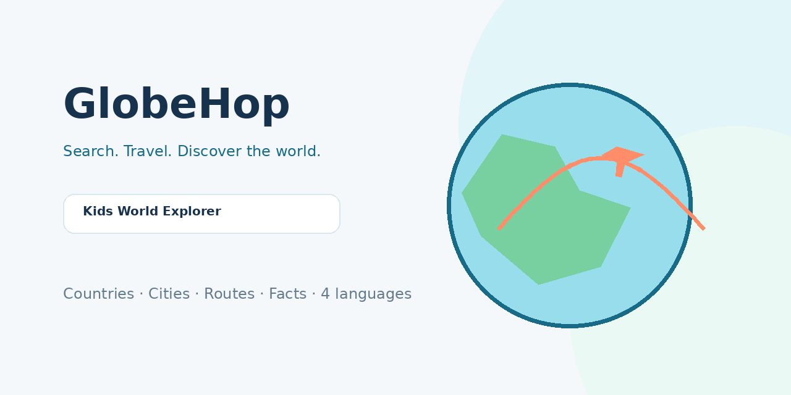

# GlobeHop 🌍✈️

A kid-friendly world explorer for GitHub Pages. Search countries, cities and featured landmarks; watch a plane, ship or train travel across a simplified globe; then compare distance, time difference and country facts.



## Preview

The first screen is a working explorer rather than a marketing placeholder. It includes:

- a searchable world index
- a simplified SVG globe with country highlighting
- animated origin → destination travel paths
- transport switching (plane / ship / train)
- country and location facts
- recent explorations and favorites
- multilingual UI and dark mode

## Features

- **232-country bundled search index** split into region files for maintainability
- **52 featured cities/landmarks** that still search when external APIs are unavailable
- optional **Open-Meteo Geocoding** lookup for broader city/place search
- optional **World Bank Indicators API** enrichment for recent population, GDP and GNI
- browser **Geolocation** origin with a clear privacy note and Seoul sample fallback
- Haversine distance and time-zone difference calculation
- kid-oriented culture/nature knowledge packs, stored one JSON file per country
- Korean, English, Japanese and Simplified Chinese UI
- `Intl.DisplayNames` country localization
- light / dark / system theme persisted in `localStorage`
- recent trips and favorites persisted in `localStorage`
- responsive layouts for 320 / 375 / 430 / 768 / 1024 / 1440+ px
- keyboard-search navigation, semantic controls, focus-visible and reduced-motion support
- PWA manifest and service worker
- favicon/app icons, Apple Touch Icon, OG image and GitHub repository social preview
- SEO metadata, JSON-LD, `robots.txt`, `sitemap.xml`
- custom 404 page
- GitHub Actions Pages deployment

> The animated route is an educational visualization. It is not a real airline, railway or shipping itinerary.

## Tech Stack

- HTML5
- CSS3
- JavaScript ES modules
- SVG
- browser Web APIs (Geolocation, Intl, LocalStorage, Service Worker)
- zero runtime npm dependencies
- custom Node build/dev scripts
- GitHub Pages + GitHub Actions

The project deliberately avoids a heavy map/UI framework because the intended map is simplified and child-friendly, not a detailed navigation map.

## Project Structure

```text
/
├─ public/
│  ├─ icons/
│  ├─ 404.html
│  ├─ favicon.svg
│  ├─ manifest.webmanifest
│  ├─ og-image.png
│  ├─ repo-social-preview.png
│  ├─ robots.txt
│  ├─ sitemap.xml
│  ├─ sw.js
│  └─ .nojekyll
├─ src/
│  ├─ data/
│  │  ├─ countries/
│  │  ├─ knowledge/
│  │  ├─ places/
│  │  └─ world-geometries.json
│  ├─ modules/
│  │  ├─ config.js
│  │  ├─ dataService.js
│  │  ├─ geo.js
│  │  ├─ globe.js
│  │  ├─ i18n.js
│  │  └─ storage.js
│  ├─ app.js
│  └─ styles.css
├─ docs/
│  ├─ ARCHITECTURE.md
│  └─ DATA_GUIDE.md
├─ scripts/
│  ├─ build.mjs
│  └─ dev-server.mjs
├─ .github/workflows/deploy.yml
├─ index.html
├─ package.json
├─ package-lock.json
└─ README.md
```

## Local Development

```bash
npm install
npm run dev
```

Open:

```text
http://localhost:5173/
```

There are no runtime npm dependencies; `npm install` primarily creates/validates the lockfile and keeps the GitHub Action workflow conventional.

## Build

```bash
npm run build
```

Output is written to `dist/`.

To inject a production canonical/OG/sitemap URL locally:

```bash
SITE_URL="https://USERNAME.github.io/REPOSITORY/" npm run build
```

## GitHub Pages Deployment

1. Create a GitHub repository and upload this project.
2. Push it to the `main` branch.
3. In GitHub, open **Settings → Pages**.
4. Under **Build and deployment**, select **GitHub Actions** as the source.
5. Push another commit or run **Actions → Deploy GlobeHop to GitHub Pages → Run workflow**.
6. The workflow resolves whether this is a project page or a user page, injects the correct public URL, builds `dist/`, uploads the Pages artifact and deploys it.

The normal flow is:

```text
git push → GitHub Actions → npm ci → npm run build → Pages artifact → deploy-pages
```

All app assets are referenced relatively, so project subpaths such as:

```text
https://USERNAME.github.io/REPOSITORY/
```

work without a Vite `base` setting.

## Configuration

Main settings live in:

```text
src/modules/config.js
```

You can change:

- app name/default locale
- supported locales
- sample origin
- geocoding endpoint
- World Bank indicator codes
- recent-history size

See [`docs/DATA_GUIDE.md`](./docs/DATA_GUIDE.md) for adding countries, places, knowledge packs and languages.

## Data Sources

- Bundled stable country reference data: generated from `countryinfo` 0.1.2 (MIT); see `NOTICE.md`.
- Place search enrichment: Open-Meteo Geocoding API.
- Current population/GDP/GNI enrichment: World Bank Indicators API v2.

For commercial use, review the current Open-Meteo licensing/plan requirements before deployment. If you need a paid API key, **do not put private keys directly into this GitHub Pages source**. Use a serverless proxy or a provider-supported public client credential strategy.

## Custom Domain

GitHub Pages supports a custom domain without changing the app's relative asset paths.

1. Configure the domain under **Settings → Pages → Custom domain**.
2. Add the required DNS records at your DNS provider.
3. Enable **Enforce HTTPS** after GitHub issues the certificate.
4. If you prefer a repository-managed `CNAME`, create `public/CNAME` containing only the domain, for example:

```text
world.example.com
```

On the next build, it will be copied into `dist/`.

## Social Preview

- Website OG image: `public/og-image.png` (1200×630)
- GitHub repository social preview: `public/repo-social-preview.png` (1280×640)

Upload `repo-social-preview.png` in **Repository Settings → Social preview**.

## PWA

The included manifest provides installable app metadata and icons. The service worker caches the core UI and locally loaded data. External API calls remain network-first and fail gracefully.

## Extending the project

Good next expansions include:

- richer country knowledge packs for all ISO countries
- `ja` / `zh` localized knowledge content per country
- continent-based place shards once the place index becomes large
- river, mountain, ocean and biome data layers
- quiz mode and collectible passport stamps
- text-to-speech pronunciation of country/capital names
- teacher/parent-curated lesson playlists
- offline downloadable continent packs

## License

Project code: MIT License. See `LICENSE` and `NOTICE.md` for bundled data notes and external API attribution.
